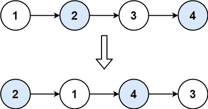

# 24. Swap Nodes in Pairs

- [Original Problem](https://leetcode.com/problems/swap-nodes-in-pairs/description/)
- [Solution](#solution)
  - [Javascript](#javascript)

## Problem
### Complexity: Medium

Given a linked list, swap every two adjacent nodes and return its head. You must solve the problem without modifying the values in the list's nodes (i.e., only nodes themselves may be changed.)

### Example 1:

> **Input:** head = [1,2,3,4]\
> **Output:** [2,1,4,3]
> **Explanation:**\
> 

### Example 2:

> **Input:** head = []\
> **Output:** []

### Example 3:

> **Input:** head = [1]\
> **Output:** [1]

### Example 4:

> **Input:** head = [1,2,3]\
> **Output:** [2,1,3]

### Constraints:

- The number of nodes in the list is in the range `[0, 100]`.
- `0 <= Node.val <= 100`

## Solution

### Javascript

[Top](#24-swap-nodes-in-pairs) | [Problem](#problem)

```javascript
/**
 * Definition for singly-linked list.
 * function ListNode(val, next) {
 *     this.val = (val===undefined ? 0 : val)
 *     this.next = (next===undefined ? null : next)
 * }
 */
/**
 * @param {ListNode} head
 * @return {ListNode}
 */
var swapPairs = function(head) {
    if(head && head.next) {
        const [h1, h2, h3] = [head, head.next, head.next.next];
        head = h2;
        head.next = h1;
        head.next.next = h3;
    } else {
        return head;
    }
    let r = head.next;
    while(r && r.next && r.next.next) {
        const [r1, r2, r3] = [r.next, r.next.next, r.next.next.next];
        r.next = r2;
        r.next.next = r1;
        r.next.next.next = r3;
        r = r.next.next;
    }

    return head;
};
```