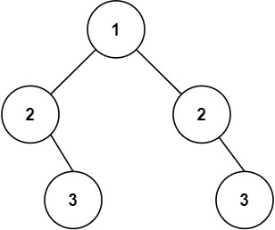

# 101. Symmetric Tree

- [Original Problem](https://leetcode.com/problems/symmetric-tree/)
- [Solution](#solution)
  - [Javascript](#javascript)

## Problem
**Complexity: Easy**

Given the `root` of a binary tree, check whether it is a mirror of itself (i.e., symmetric around its center).

### Example 1:


> **Input:** root = [1,2,2,3,4,4,3]\
> **Output:** true

### Example 2:



> **Input:** root = [1,2,2,null,3,null,3]\
> **Output:** false

### Constraints:
- The number of nodes in the tree is in the range `[1, 1000]`.
- `-100 <= Node.val <= 100`

**Follow up:** Could you solve it both recursively and iteratively?

## Solution

### Javascript

[Top](#101-symmetric-tree) |
[Problem](#problem) |
[Solution](#solution) (<small>
    Javascript
</small>)

```javascript
/**
 * Definition for a binary tree node.
 * function TreeNode(val, left, right) {
 *     this.val = (val===undefined ? 0 : val)
 *     this.left = (left===undefined ? null : left)
 *     this.right = (right===undefined ? null : right)
 * }
 */
/**
 * @param {TreeNode} root
 * @return {boolean}
 */
var isSymmetric = function(root) {
    if(!root) {
        return true;
    }
    const stackL = [root.left];
    const stackR = [root.right];
    while(stackL.length > 0) {
        const l = stackL.pop();
        const r = stackR.pop();
        if(l?.val !== r?.val) {
            return false;
        }
        if(l !== null) {
            stackL.push(l.left);
            stackL.push(r.left);
            stackR.push(r.right);
            stackR.push(l.right);
        }
    }
    return true;
};
```
