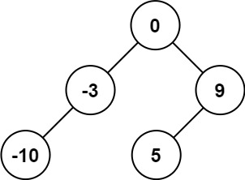
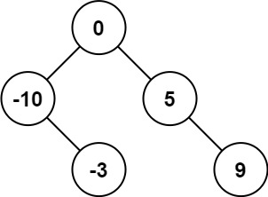
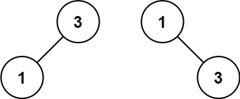

# 108. Convert Sorted Array to Binary Search Tree

- [Original Problem](https://leetcode.com/problems/convert-sorted-array-to-binary-search-tree/)
- [Solution](#solution)
  - [C#](#c)

## Problem
**Complexity: Easy**

Given an integer array `nums` where the elements are sorted in ascending order, convert it to a height-balanced binary search tree.

### Example 1:



> **Input:** nums = [-10,-3,0,5,9]\
> **Output:** [0,-3,9,-10,null,5]\
> **Explanation:** [0,-10,5,null,-3,null,9] is also accepted:



### Example 2:



> **Input:** nums = [1,3]\
> **Output:** [3,1]\
> **Explanation:** [1,null,3] and [3,1] are both height-balanced BSTs.

### Constraints:
- 1 <= nums.length <= 10<sup>4</sup>
- -10<sup>4</sup> <= nums[i] <= 10<sup>4</sup>
- `nums` is sorted in a strictly increasing order.

## Solution

### C#

[Top](#108-convert-sorted-array-to-binary-search-tree) |
[Problem](#problem) |
[Solution](#solution) (<small>
    C#
</small>)

```csharp
/**
 * Definition for a binary tree node.
 * public class TreeNode {
 *     public int val;
 *     public TreeNode left;
 *     public TreeNode right;
 *     public TreeNode(int val=0, TreeNode left=null, TreeNode right=null) {
 *         this.val = val;
 *         this.left = left;
 *         this.right = right;
 *     }
 * }
 */
public class Solution {
    private TreeNode bstFromArray(int[] nums, int minIdx, int maxIdx) {
        if(maxIdx - minIdx == 0) {
            return new TreeNode(nums[minIdx]);
        }
        if(maxIdx - minIdx == 1) {
            return new TreeNode(nums[maxIdx], new TreeNode(nums[minIdx]));
        }
        if(maxIdx - minIdx == 2) {
            return new TreeNode(nums[minIdx+1], new TreeNode(nums[minIdx]), new TreeNode(nums[maxIdx]));
        }
        
        var middle = (maxIdx + minIdx + 1) / 2;
        return new TreeNode(nums[middle], bstFromArray(nums, minIdx, middle - 1), bstFromArray(nums, middle + 1, maxIdx));
        
    }
    
    public TreeNode SortedArrayToBST(int[] nums) {
        if(nums.Length == 0) {
            return null;
        }
        return bstFromArray(nums, 0, nums.Length - 1);
    }
}
```
