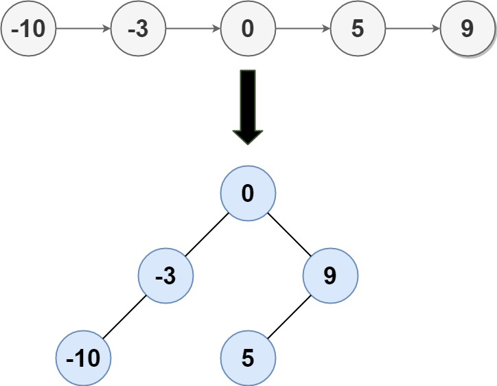

# 109. Convert Sorted List to Binary Search Tree

- [Original Problem](https://leetcode.com/problems/convert-sorted-list-to-binary-search-tree/)
- [Solution](#solution)
  - [Javascript](#javascript)

## Problem
**Complexity: Medium**

Given the `head` of a singly linked list where elements are sorted in ascending order, convert it to a height-balanced binary search tree.

### Example 1:



> **Input:** head = [-10,-3,0,5,9]\
> **Output:** [0,-3,9,-10,null,5]\
> **Explanation:** One possible answer is [0,-3,9,-10,null,5], which represents the shown height balanced BST.

### Example 2:
> **Input:** head = []\
> **Output:** []

### Constraints:
- The number of nodes in `head` is in the range [0, 2 * 10<sup>4</sup>].
- -10<sup>5</sup> <= Node.val <= 10<sup>5</sup>

## Solution

### Javascript

[Top](#109-convert-sorted-list-to-binary-search-tree) |
[Problem](#problem) |
[Solution](#solution) (<small>
    Javascript
</small>)

```javascript
/**
 * Definition for singly-linked list.
 * function ListNode(val, next) {
 *     this.val = (val===undefined ? 0 : val)
 *     this.next = (next===undefined ? null : next)
 * }
 */
/**
 * Definition for a binary tree node.
 * function TreeNode(val, left, right) {
 *     this.val = (val===undefined ? 0 : val)
 *     this.left = (left===undefined ? null : left)
 *     this.right = (right===undefined ? null : right)
 * }
 */
/**
 * @param {ListNode} head
 * @return {TreeNode}
 */
var sortedListToBST = function(head) {
    if(!head) {
        return null;
    }
    let a = [];
    for(let n = head; !!n; n = n.next) {
        a.push(n.val);
    }
    const subtree = (l, r) => {
        if(l === r) {
            return new TreeNode(a[l]);
        }
        if(l === r - 1) {
            return new TreeNode(
                a[l],
                null,
                new TreeNode(a[r])
            );
        }
        const mid = l + Math.floor((r-l)/2);

        return new TreeNode(
            a[mid], 
            subtree(l, mid - 1), 
            subtree(mid + 1, r)
        );
    };

    return subtree(0, a.length - 1);
};
```
