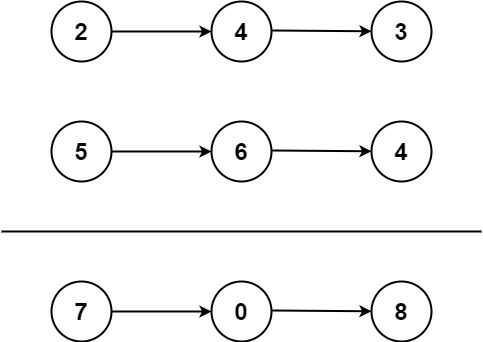

# 2. Add Two Numbers

- [Original Problem](https://leetcode.com/problems/add-two-numbers/description/)
- [Solution 1. Javascript](#javascript-solution)
- [Solution 2. C#](#c-solution)

## Problem
### Complexity: Medium

You are given two **non-empty** linked lists representing two non-negative integers. The digits are stored in **reverse** order, and each of their nodes contains a single digit. Add the two numbers and return the sum as a linked list.

You may assume the two numbers do not contain any leading zero, except the number 0 itself.

## Example 1:


> **Input:** l1 = [2,4,3], l2 = [5,6,4]\
> **Output:** [7,0,8]\
> **Explanation:** 342 + 465 = 807.

## Example 2:

> **Input:** l1 = [0], l2 = [0]\
> **Output:** [0]

## Example 3:

> **Input:** l1 = [9,9,9,9,9,9,9], l2 = [9,9,9,9]\
> **Output:** [8,9,9,9,0,0,0,1]
 

## Constraints:

- The number of nodes in each linked list is in the range `[1, 100]`.
- `0 <= Node.val <= 9`
- It is guaranteed that the list represents a number that does not have leading zeros.


## Javascript solution
[Top](#2-add-two-numbers) | 
[Problem](#problem) |
Javascript Solution |
[C# Solution](#c-solution)

```javascript
/**
 * Definition for singly-linked list.
 * public class ListNode {
 *     public int val;
 *     public ListNode next;
 *     public ListNode(int val=0, ListNode next=null) {
 *         this.val = val;
 *         this.next = next;
 *     }
 * }
 */
public class Solution {
    public ListNode AddTwoNumbers(ListNode l1, ListNode l2) {
        var ll1 = l1;
        var ll2 = l2;
        int adder = 0;
        ListNode result = null, current = null;
        while(ll1 != null || ll2 != null) {
            var digit = adder + 
                (ll2 == null ? 0 : ll2.val) +
                (ll1 == null ? 0 : ll1.val);
            if(digit >= 10) {
                adder = 1;
                digit = digit % 10;
            } else {
                adder = 0;
            }
            if(result == null) {
                result = new ListNode(digit);
                current = result;
            } else {
                current.next = new ListNode(digit);
                current = current.next;
            }
            
            ll1 = ll1 == null ? null : ll1.next;
            ll2 = ll2 == null ? null : ll2.next;
        }
        if(adder > 0) {
            current.next = new ListNode(1);
        }
        
        return result;
    }
}
```


## C# Solution
[Top](#2-add-two-numbers) | 
[Problem](#problem) |
[Javascript Solution](#javascript-solution) |
C# Solution

```csharp
/**
 * Definition for singly-linked list.
 * public class ListNode {
 *     public int val;
 *     public ListNode next;
 *     public ListNode(int val=0, ListNode next=null) {
 *         this.val = val;
 *         this.next = next;
 *     }
 * }
 */
public class Solution {
    public ListNode AddTwoNumbers(ListNode l1, ListNode l2) {
        var ll1 = l1;
        var ll2 = l2;
        int adder = 0;
        ListNode result = null, current = null;
        while(ll1 != null || ll2 != null) {
            var digit = adder + 
                (ll2 == null ? 0 : ll2.val) +
                (ll1 == null ? 0 : ll1.val);
            if(digit >= 10) {
                adder = 1;
                digit = digit % 10;
            } else {
                adder = 0;
            }
            if(result == null) {
                result = new ListNode(digit);
                current = result;
            } else {
                current.next = new ListNode(digit);
                current = current.next;
            }
            
            ll1 = ll1 == null ? null : ll1.next;
            ll2 = ll2 == null ? null : ll2.next;
        }
        if(adder > 0) {
            current.next = new ListNode(1);
        }
        
        return result;
    }
}
```