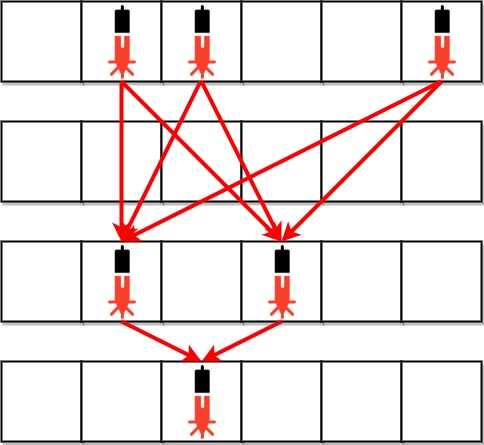
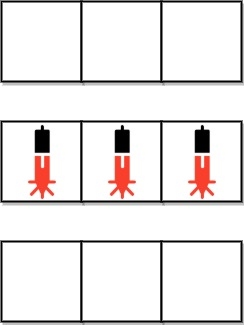

# 2125. Number of Laser Beams in a Bank

- [Original Problem](https://leetcode.com/problems/number-of-laser-beams-in-a-bank/description/)
- [Solution](solution)
  - [Javascript](#javascript)
  - [C# Version 1](#c-version-1)
  - [C# Version 2](#c-version-2)

## Problem
### Complexity: Medium

Anti-theft security devices are activated inside a bank. You are given a **0-indexed** binary string array bank representing the floor plan of the bank, which is an `m x n` 2D matrix. `bank[i]` represents the i<sup>th</sup> row, consisting of `'0'`s and `'1'`s. `'0'` means the cell is empty, while `'1'` means the cell has a security device.

There is **one** laser beam between any **two** security devices **if both** conditions are met:

- The two devices are located on two **different rows**: `r1` and `r2`, where `r1 < r2`.
- For **each** row `i` where `r1 < i < r2`, there are **no security devices** in the i<sup>th</sup> row.

Laser beams are independent, i.e., one beam does not interfere nor join with another.

Return __the total number of laser beams in the bank__.


## Example 1:



> **Input:** bank = ["011001","000000","010100","001000"]\
> **Output:** 8\
> **Explanation:** Between each of the following device pairs, there is one beam. In total, there are 8 beams:
> * bank[0][1] -- bank[2][1]
> * bank[0][1] -- bank[2][3]
> * bank[0][2] -- bank[2][1]
> * bank[0][2] -- bank[2][3]
> * bank[0][5] -- bank[2][1]
> * bank[0][5] -- bank[2][3]
> * bank[2][1] -- bank[3][2]
> * bank[2][3] -- bank[3][2]
> Note that there is no beam between any device on the 0<sup>th</sup> row with any on the 3<sup>rd</sup> row.\
> This is because the 2<sup>nd</sup> row contains security devices, which breaks the second condition.

## Example 2:



> **Input:** bank = ["000","111","000"]\
> **Output:** 0\
> **Explanation:** There does not exist two devices located on two different rows.
 
## Constraints:

- `m == bank.length`
- `n == bank[i].length`
- `1 <= m, n <= 500`
- `bank[i][j]` is either `'0'` or `'1'`.

## Solution

### Approach
We need to calculate how many lasers can be set between two consequtive rows with beams only.
If there are any "empty" rows between them, they don't affect the number of lasers. If we have beams in rows 1, 2 and 3, we need to count lasers between rows 1 and 2, and lasers between 2 and 3. Lasers between 1 and 3 could not exist because of the second constraint of the problem.

If lasers are set between all possible beams, then their quantity between two rows equals to a product of sum of the beams in first row and sum of the beams in second row.

### Javascript
[Top](#2125-number-of-laser-beams-in-a-bank) |
[Problem](#problem) |
[Solution](solution) (
Javascript |
[C# Version 1](#c-version-1) |
[C# Version 2](#c-version-2) )

```javascript
/**
 * @param {string[]} bank
 * @return {number}
 */
var numberOfBeams = function(bank) {
    let res = 0, prev = 0;
    for(const row of bank) {
        const devices = [...row].reduce((s, c) => s + (+c), 0);
        if(devices > 0) {
            if(prev > 0) {
                res += devices * prev;
            }
            prev = devices;
        }
    }
    return res;
};
```

### C# Version 1
[Top](#2125-number-of-laser-beams-in-a-bank) |
[Problem](#problem) |
[Solution](solution) (
[Javascript](#javascript) |
C# Version 1 |
[C# Version 2](#c-version-2) )

This solution looks "fancy" and uses `LINQ`. It even can be considered a one-lines (split on several lines for better readability). But it's slower.

```csharp
public class Solution {
    public int NumberOfBeams(string[] bank) {
        return bank
            .Select((row) => row.Count((c) => c == '1'))
            .Where(d => d > 0)
            .Aggregate((sum: 0, prev: 0),
                (acc, d) => (sum: acc.sum + acc.prev * d, prev: d))
            .sum;
    }
}
```

### C# Version 2
[Top](#2125-number-of-laser-beams-in-a-bank) |
[Problem](#problem) |
[Solution](solution) (
[Javascript](#javascript) |
[C# Version 1](#c-version-1) |
C# Version 2 )

This solution has same idea, but uses implicit loops instead of `LINQ`.

```csharp
public class Solution {
    public int NumberOfBeams(string[] bank) {
        var (result, prev) = (0, 0);
        foreach(var row in bank) {
            var devices = 0;
            foreach(var c in row) {
                if(c == '1') {
                    devices++;
                }
            }
            if(devices > 0) {
                result += devices * prev;
                prev = devices;
            }
        }

        return result;
    }
}
```