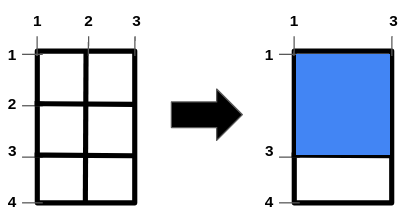
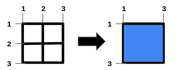
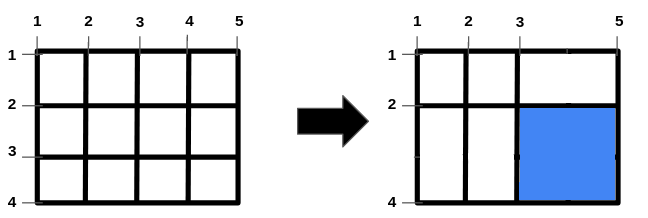

# 2943. Maximize Area of Square Hole in Grid

- [Original Problem](https://leetcode.com/problems/maximize-area-of-square-hole-in-grid/description/)
- [Solution](#solution)
  - [Javascript](#javascript)

## Problem
**Complexity: Medium**

You are given the two integers, `n` and `m` and two integer arrays, `hBars` and `vBars`. The grid has `n + 2` horizontal and `m + 2` vertical bars, creating 1 x 1 unit cells. The bars are indexed starting from `1`.

You can remove some of the bars in `hBars` from horizontal bars and some of the bars in `vBars` from vertical bars. Note that other bars are fixed and cannot be removed.

Return an integer denoting the **maximum area** of a **square-shaped** hole in the grid, after removing some bars (possibly none).

### Example 1:



> **Input:** n = 2, m = 1, hBars = [2,3], vBars = [2]\
> **Output:** 4\
> **Explanation:** The left image shows the initial grid formed by the bars. The horizontal bars are `[1,2,3,4]`, and the vertical bars are `[1,2,3]`. One way to get the maximum square-shaped hole is by removing horizontal bar 2 and vertical bar 2.

### Example 2:



> **Input:** n = 1, m = 1, hBars = [2], vBars = [2]\
> **Output:** 4\
> **Explanation:** To get the maximum square-shaped hole, we remove horizontal bar 2 and vertical bar 2.

### Example 3:



> **Input:** n = 2, m = 3, hBars = [2,3], vBars = [2,4]\
> **Output:** 4\
> **Explanation:** One way to get the maximum square-shaped hole is by removing horizontal bar 3, and vertical bar 4.

### Constraints:
- 1 <= n <= 10<sup>9</sup>
- 1 <= m <= 10<sup>9</sup>
- 1 <= hBars.length <= 100
- 2 <= hBars[i] <= n + 1
- 1 <= vBars.length <= 100
- 2 <= vBars[i] <= m + 1
- All values in `hBars` are distinct.
- All values in `vBars` are distinct.

## Solution

### Javascript
**Runtime: 1ms, Beats: 100%**

[Top](#2943-maximize-area-of-square-hole-in-grid) |
[Problem](#problem) |
[Solution](#solution) (<small>
    Javascript
</small>)

```javascript
/**
 * @param {number} n
 * @param {number} m
 * @param {number[]} hBars
 * @param {number[]} vBars
 * @return {number}
 */
var maximizeSquareHoleArea = function(n, m, hBars, vBars) {
    const longestConsequtive = (arr) => {
        const set = new Set(arr);
        let longest = 1;
        for(let c of set) {
            if(!set.has(c - 1)) {
                let len = 1, cur = c;
                while(set.has(cur + 1)) {
                    cur++;
                    len++;
                }
                if(len > longest) {
                    longest = len;
                }

            }
        }

        return longest;
    }

    return (Math.min(longestConsequtive(hBars), longestConsequtive(vBars)) + 1) ** 2;
};
```
