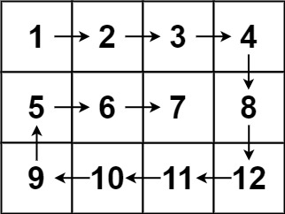

# 54. Spiral Matrix

- [Original Problem](https://leetcode.com/problems/spiral-matrix/description/)
- [Solution](#solution)
  - [Javascript](#javascript)

## Problem 

Given an `m x n` `matrix`, return _all elements of the `matrix` in spiral order_.

### Example 1:


> **Input:** matrix = [[1,2,3],[4,5,6],[7,8,9]]\
> **Output:** [1,2,3,6,9,8,7,4,5]

### Example 2:



> **Input:** matrix = [[1,2,3,4],[5,6,7,8],[9,10,11,12]]\
> **Output:** [1,2,3,4,8,12,11,10,9,5,6,7]
 
### Constraints:

- `m == matrix.length`
- `n == matrix[i].length`
- `1 <= m, n <= 10`
- `-100 <= matrix[i][j] <= 100`

## Solution
### Javascript

[Top](#54-spiral-matrix) | [Problem](#problem)

```javascript
/**
 * @param {number[][]} matrix
 * @return {number[]}
 */
var spiralOrder = function(matrix) {
    const dirs = [[0, 1], [1, 0], [0, -1], [-1, 0]];
    const height = matrix.length - 1;
    const width = matrix[0].length - 1;
    const totalCount = (height + 1) * (width + 1)
    const visited = 1000;

    let dir = 0, x = 0, y = 0, count = 1;
    const result = [matrix[y][x]];
    matrix[y][x] = visited;

    while(count < totalCount) {
        const newX = x + dirs[dir][1];
        const newY = y + dirs[dir][0];

        if(newX < 0 || newY < 0 || newX > width || newY > height || matrix[newY][newX] === visited) {
            dir = dir === 3 ? 0 : dir + 1;
        } else {
            x = newX;
            y = newY;
            result.push(matrix[y][x]);
            matrix[y][x] = visited;
            count++;
        }
    }

    return result;
};
```