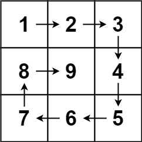

# 59. Spiral Matrix II

- [Original Problem](https://leetcode.com/problems/spiral-matrix-ii/description/)
- [Solution](#solution)
  - [Javascript](#javascript)

## Problem
**Complexity: Medium**

Given a positive integer `n`, generate an `n x n` `matrix` filled with elements from 1 to n<sup>2</sup> in spiral order.

### Example 1:



> **Input:** n = 3\
> **Output:** [[1,2,3],[8,9,4],[7,6,5]]

## Example 2:

> **Input:** n = 1\
> **Output:** [[1]]
 

### Constraints:

- `1 <= n <= 20`

## Solution
### Javascript

[Top](#59-spiral-matrix-ii) | [Problem](#problem)

```javascript
/**
 * @param {number} n
 * @return {number[][]}
 */
var generateMatrix = function(n) {
    const dirs = [[0, 1], [1, 0], [0, -1], [-1, 0]];
    const matrix = new Array(n);
    for(let i = 0; i < n; i++) {
        matrix[i] = new Array(n);
        matrix[i].fill(0);
    }

    const height = n, width = n;
    const totalCount = n * n

    let dir = 0, x = -1, y = 0, count = 1;

    while(count <= totalCount) {
        const newX = x + dirs[dir][1];
        const newY = y + dirs[dir][0];

        if(newX < 0 || newY < 0 || newX >= width || newY >= height || matrix[newY][newX] !== 0) {
            dir = dir === 3 ? 0 : dir + 1;
        } else {
            x = newX;
            y = newY;
            matrix[y][x] = count;
            count++;
        }
    }

    return matrix;
};
```