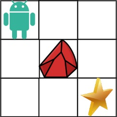

# 63. Unique Paths II

- [Original Problem](https://leetcode.com/problems/unique-paths-ii/description/)
- [Solution](#solution)
  - [Javascript](#javascript)

## Problem
***Complexity: Medium**

You are given an `m x n` integer array `grid`. There is a robot initially located at the **top-left corner** (i.e., `grid[0][0]`). The robot tries to move to the **bottom-right corner** (i.e., `grid[m - 1][n - 1]`). The robot can only move either down or right at any point in time.

An obstacle and space are marked as `1` or `0` respectively in `grid`. A path that the robot takes cannot include **any** square that is an obstacle.

Return _the number of possible unique paths that the robot can take to reach the bottom-right corner_.

The testcases are generated so that the answer will be less than or equal to 2 * 10<sup>9</sup>.

### Example 1:



> **Input:** obstacleGrid = [[0,0,0],[0,1,0],[0,0,0]]\
> **Output:** 2\
> **Explanation:** There is one obstacle in the middle of the 3x3 grid above.\
> There are two ways to reach the bottom-right corner:\
> 1. Right -> Right -> Down -> Down
> 2. Down -> Down -> Right -> Right

### Example 2:


> **Input:** obstacleGrid = [[0,1],[0,0]]\
> **Output:** 1
 
### Constraints:

- `m == obstacleGrid.length`
- `n == obstacleGrid[i].length`
- `1 <= m, n <= 100`
- `obstacleGrid[i][j]` is `0` or `1`.

## Solution
### Javascript

[Top](#63-unique-paths-ii) | [Problem](#problem)

```javascript
/**
 * @param {number[][]} obstacleGrid
 * @return {number}
 */
var uniquePathsWithObstacles = function(obstacleGrid) {
    const height = obstacleGrid.length - 1;
    const width = obstacleGrid[0].length - 1;
    if(obstacleGrid[height][width] === 1) {
        return 0;
    }

    const line = new Array(width).fill(0);
    line[width] = 1;

    for(let y = height; y >= 0; y--) {
        for(let x = width; x >= 0; x--) {
            if(obstacleGrid[y][x] === 0) {
                line[x] = line[x] + (x < width ? line[x + 1]  : 0);
            } else {
                line[x] = 0;
            }
        }
    }

    return line[0];
};
```