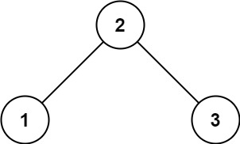
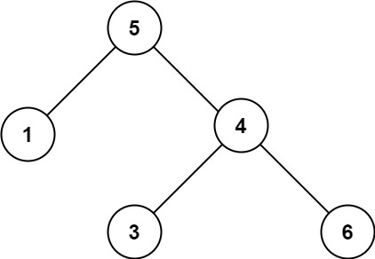

# 98. Validate Binary Search Tree

- [Original Problem](https://leetcode.com/problems/validate-binary-search-tree/)
- [Solution](#solution)
    - [C#](#c)

## Problem
**Complexity: Medium**

Given the `root` of a binary tree, determine if it is a valid binary search tree (BST).

A valid BST is defined as follows:

- The left subtree of a node contains only nodes with keys strictly less than the node's key.
- The right subtree of a node contains only nodes with keys strictly greater than the node's key.
- Both the left and right subtrees must also be binary search trees.

### Example 1:



> **Input:** root = [2,1,3]\
> **Output:** true

### Example 2:



> **Input:** root = [5,1,4,null,null,3,6]\
> **Output:** false\
> **Explanation:** The root node's value is 5 but its right child's value is 4.

### Constraints:
- The number of nodes in the tree is in the range `[1, 10<sup>4</sup>]`.
- `-2<sup>31</sup> <= Node.val <= 2<sup>31</sup> - 1`

## Solution

### C#

[Top](#98-validate-binary-search-tree) |
[Problem](#problem) |
[Solution](#solution) (<small>
    C#
</small>)

```csharp
/**
 * Definition for a binary tree node.
 * public class TreeNode {
 *     public int val;
 *     public TreeNode left;
 *     public TreeNode right;
 *     public TreeNode(int val=0, TreeNode left=null, TreeNode right=null) {
 *         this.val = val;
 *         this.left = left;
 *         this.right = right;
 *     }
 * }
 */
public class Solution {
    private bool checkValidBst(TreeNode node, int minValue, int maxValue, bool mostRight, bool mostLeft) {
        if(node == null) {
            return true;
        }
        if((node.val >= maxValue && !mostRight) || (node.val <= minValue && !mostLeft)) {
            return false;
        }
        return checkValidBst(node.left, minValue, node.val, false, mostLeft) 
            && checkValidBst(node.right, node.val, maxValue, mostRight, false);
    } 
    public bool IsValidBST(TreeNode root) {
        return checkValidBst(root, Int32.MinValue, Int32.MaxValue, true, true);
    }
}
```
